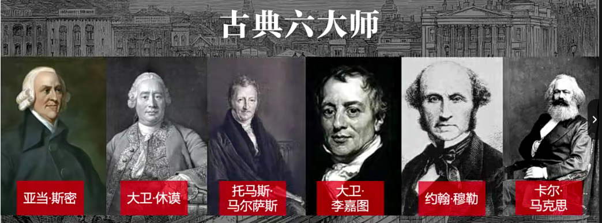
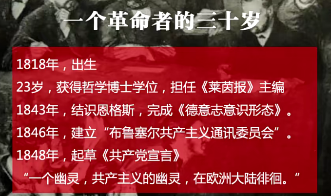
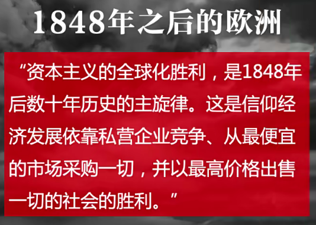

# 影响商业的50本书

吴晓波

- [影响商业的50本书](#影响商业的50本书)
  - [国富论](#国富论)
    - [总结](#总结)
  - [资本论](#资本论)

## 国富论

作者：1723亚当斯密
出版：1776(独立宣言、国富论)

工业革命是分界点：国家、工厂

- 人文革命18世纪：启蒙运动，人的独立，现代性的诞生
- 经济运动：第一次工业革命，蒸汽机。英国人发明：焦炭冶炼法，炼钢。

出现全新的结构：工厂。国家与工厂的关系，工人与工厂之间的关系。

经济学的基本原理：

1. 经济体开始运转最基本的要素：劳动(马克思、凯恩斯)、土地(土地和在土地上进行的经济活动有关系)、资本(资本运营，东西方、圣经、伊斯兰教在所有阶层中都是低级的存在)
2. 看不见的手(市场的力量)西方认为性本恶：伊甸园、人是贪婪的、上帝的罪人、自己的灵魂交给上帝。自私的行为导致了利他性的结果，这样社会就发生改变了。
3. 工厂中如何提高效率：分工，流水线，并行模型。

1908年亨利福特，开始发明了生产线。分工理论才进入汽车行业。

公元前六世纪，齐国、管仲：士农工商，每一个专业的人在一个村子里面，子子孙孙都做一件事，这导致中国的手工业发展比其他国家早。但是没有发展到工业里面。

现代化与现代性

1. 现代意识的人
2. 现代意识的国家
3. 现代经济学

亚当斯密还研究了什么是现代意义上的国家

国家是暴力机器，有以下职责：

1. 保护社会：保护公民免受暴乱和其他国家侵略的责任
2. 保护社会的每一个成员：免遭社会其他社会成员施与的不义和压迫的责任
3. 建立并维持一定量的公共工程和公共机构的责任

现代国家的责任，国家与公民之间的关系。

什么是好的经济制度：好的经济制度就是鼓励每个人去创造财富的制度

国富论在1902年(原富)就已经引入了。

推荐书籍：亚当斯密传、凯恩斯传

现代经济学的基础：国富论、资本论、通论。

### 总结

1. 经济研究的三大基本要素是劳动、土地和资本
2. 看不见的手
3. 分工定律(斯密定律)

## 资本论

一本为革命诞生的书

卡尔马克思，德国哲学家，出生 1818 年，马克思是行动主义者。

> 我要选择那些最能为人类而工作的职业，面对我们的骨灰，高尚的人们将洒下热泪。
> ——马克思17岁中学毕业论文《青年在选择职业时的考虑》

改造世界更重要

面对主义一定要警惕

德国汉堡大学23岁博士

马克思的传记

25岁与恩格斯相遇

两年后《德意志意识形态》提出历史唯物主义

1846 布鲁塞尔成立全球第一个叫”共产主义通讯委员会“

1848 年，《共产党宣言》

托克维尔：《旧制度与法国大革命》

中国 1840 年鸦片战争

英国占领印度

英国、法国 ---> 清 鸦片战争

世界的转折点

这个就是资本论。

政治经济学的理论作品。

直接劳动和间接劳动

第一价值与剩余价值，7下8上，改革开放前期的教条化，安徽芜湖年广久。

间接利润的公有化，直接劳动间接劳动推出来的结论。

值得看两遍
