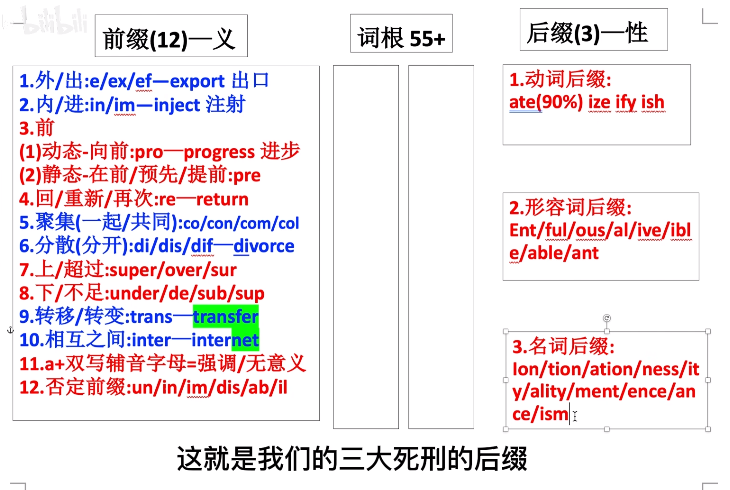

# 英语学习

## 词根词缀

## 如何提高口语

母语 ---> 听 ---> 自己复述

1. 记住关键词和大概的印象，然后重组。暴露自己的中文习惯，修正自己的语言习惯。
2. 听力越来越好，重复的听。
3. 高意识的输入：完全掌握，分析表达。
4. 语音语调上的修正。

注意：

1. 选材：真人讲话、采访而不是新闻播报的稿子。
2. 亮一定要始终，一开始 2 分钟，每一句话尽量充分练习。
3. 一句话的长度也要适中。

小 tips：

1. 我说给他听
2. 区分语义的部分被忽略了，母音一定要阅读正确
3. 欲望和目标很重要
4. 好的学习方法，回音记忆

外教总结：

1. 学语言的时候，想到对方感受，懂得那种不耐烦的感受，然后避免让别人觉得不耐烦。要发音标准。
2. 目的：报着愉快地和人交流的目的学习
3. 方法：每天十分钟，用回音法练习
回音法三步骤：listen听原文、echo回想原来的声音、repeat复读

好的、优秀的影视材料。
