# Differential Privacy

## 隐私保护的挑战

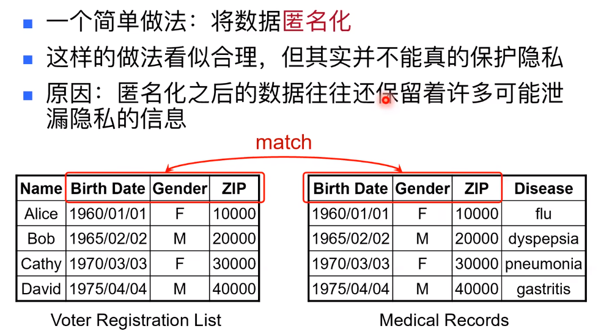  
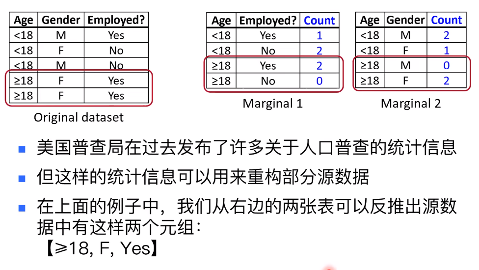  
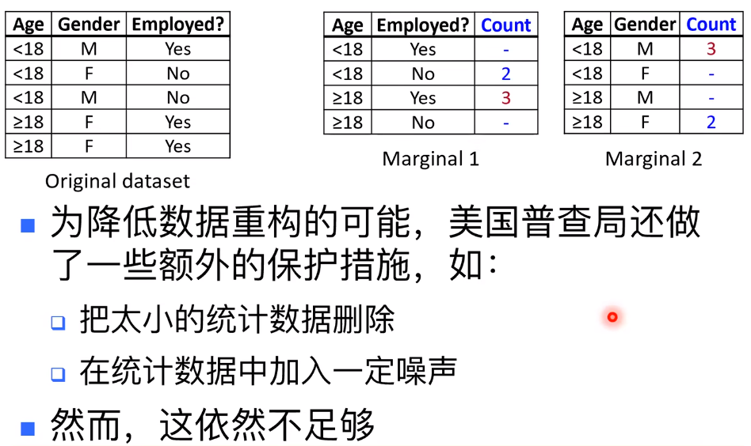  

数据重构攻击，线性规划问题

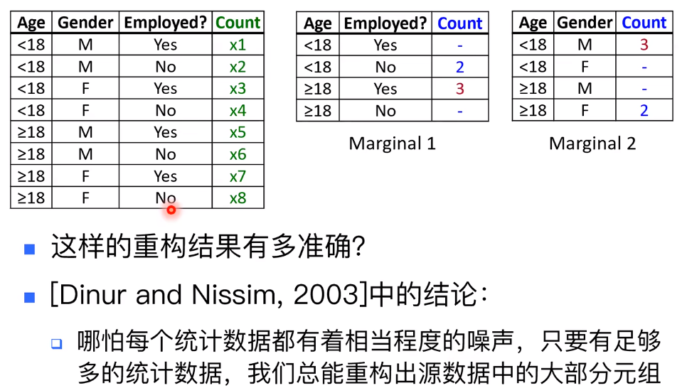  

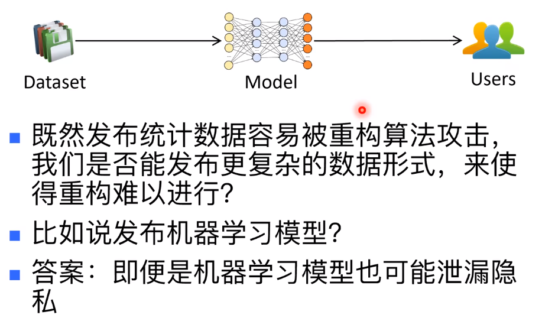  

对机器学习模型的隐私攻击：R. Shokri, M. Stronati, C. Song, V. Shmatikov: Membership lnference Attacks AgainstMachine Learning Models.IEEE Svmposium onand Privacv2017:3-18

对自然语言模型的攻击：Neural Networks.USENIX Security 2019 N. Carlini, etc.: The Secret Sharer: Evaluating and Testing Unintended Memorization in

## 差分隐私

- xdu是什么
- LDP是什么

### 差分隐私的定义

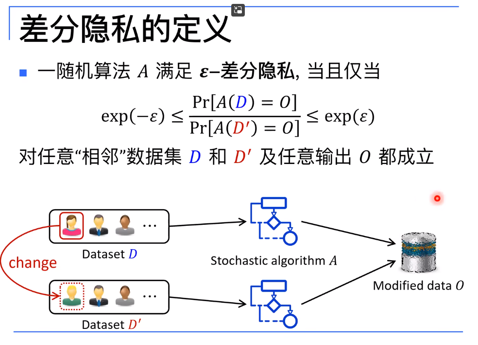  
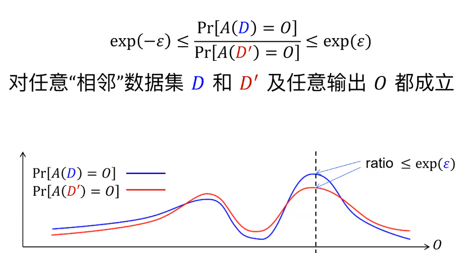  

### 如何设计满足差分隐私的算法

考虑发布的信息是否对个体的数据依赖性大？如果依赖性大，那么噪音就要大一点，反制小一点。

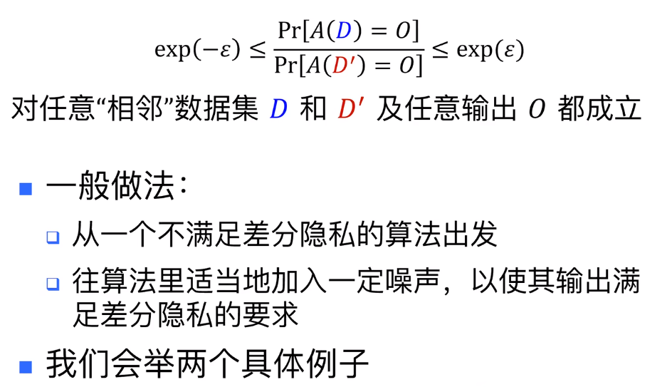  

#### 拉普拉斯机制

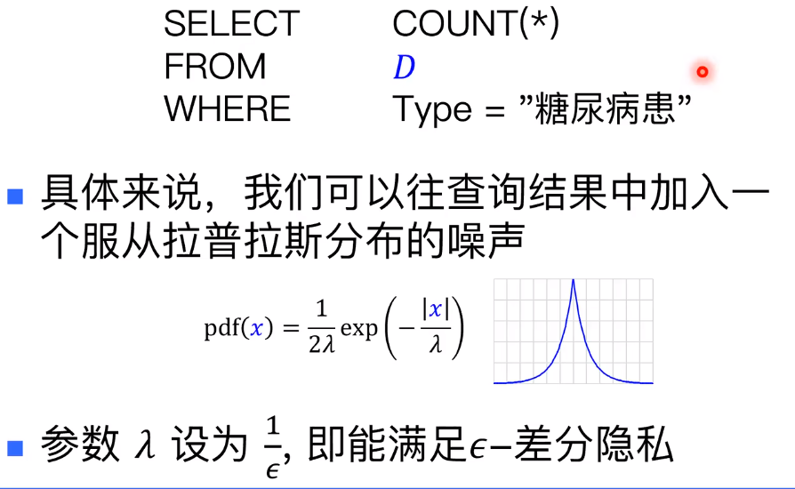  

- "1"是当修改个体数据时，统计数据最大的改变量

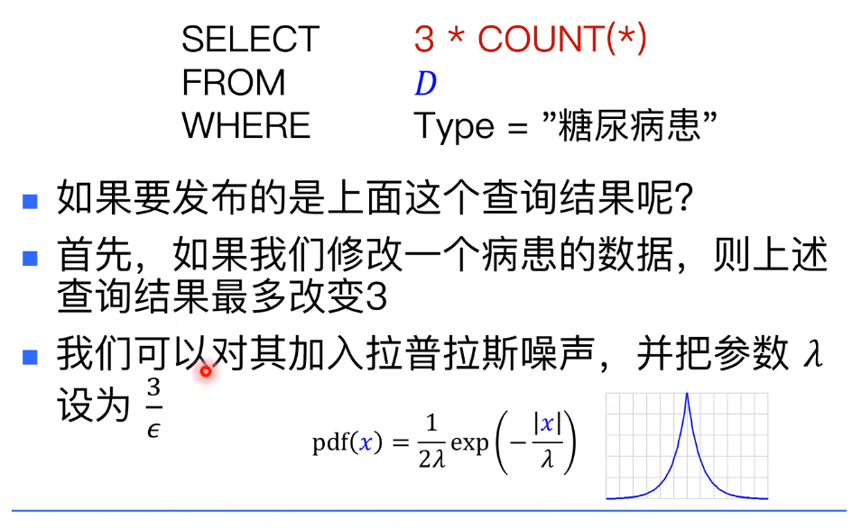  
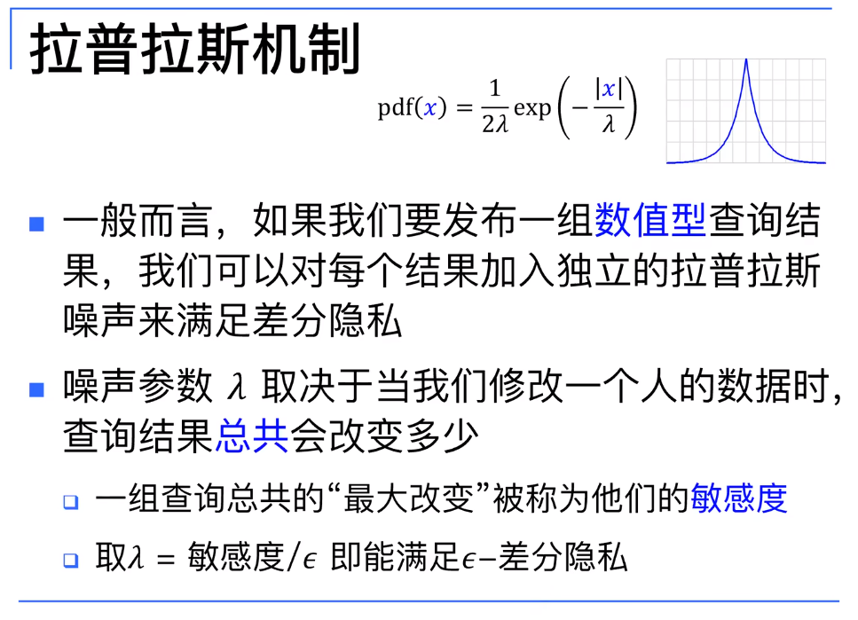  

#### 随机化回答

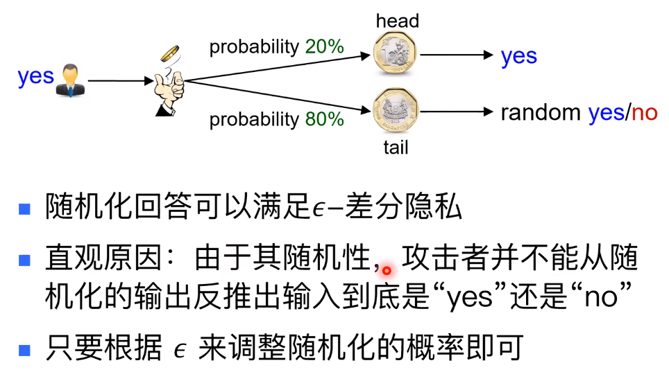  
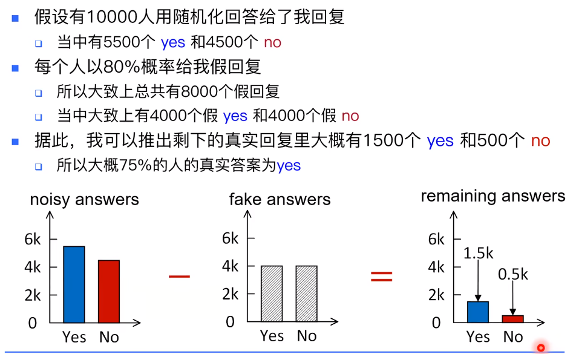  

- 还有很多的差分隐私算法

### 差分隐私应用

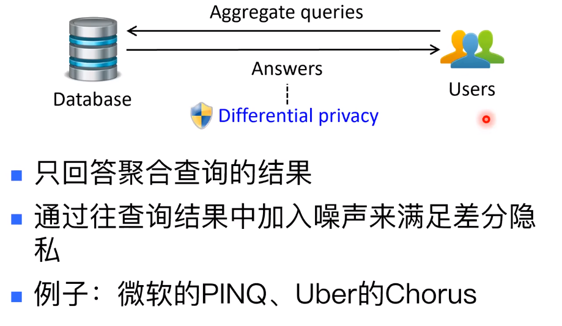  

## Reference

- [差分隐私：原理、应用与展望](https://www.bilibili.com/video/BV1Tk4y117uA/?spm_id_from=333.337.search-card.all.click)
- [A Course on Differential Privacy](https://www.bilibili.com/video/BV1Tk4y117uA/?spm_id_from=333.337.search-card.all.click&vd_source=25509bb582bc4a25d86d871d5cdffca3)
