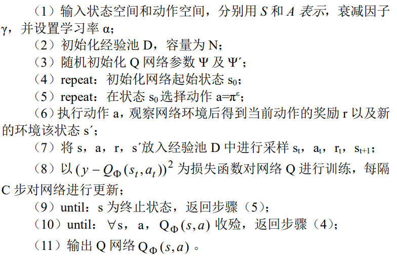
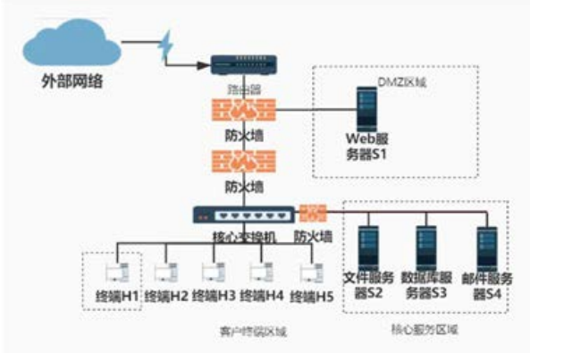
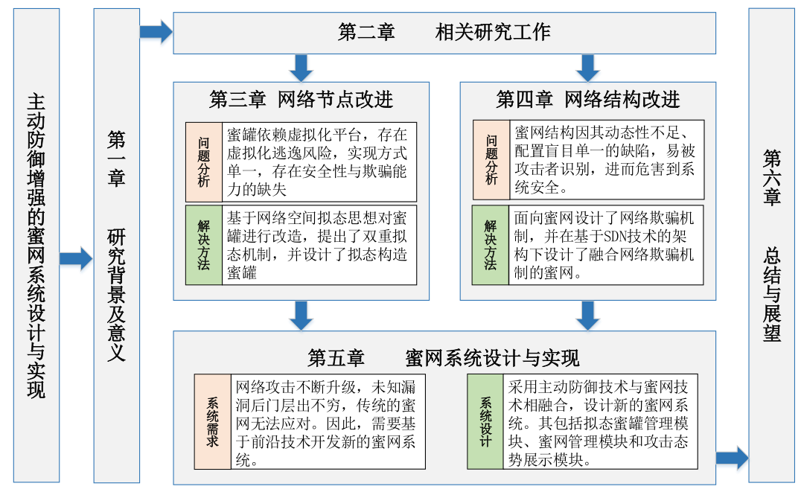

- [基于强化学习的网络欺骗防御动态部署研究](#基于强化学习的网络欺骗防御动态部署研究)
- [面向网络欺骗防御的攻击诱捕技术研究](#面向网络欺骗防御的攻击诱捕技术研究)
- [面向智能渗透攻击的欺骗防御方法](#面向智能渗透攻击的欺骗防御方法)
- [主动防御增强的蜜网系统设计与实现](#主动防御增强的蜜网系统设计与实现)
  - [论文结构总结](#论文结构总结)
  - [Note](#note)
- [Reference](#reference)

基本概念：

- SDN
- 博弈论
- 强化学习
- 蜜网技术：第一代、第二代和第三代蜜网技术

# [基于强化学习的网络欺骗防御动态部署研究](https://kns.cnki.net/kcms2/article/abstract?v=3uoqIhG8C44YLTlOAiTRKibYlV5Vjs7iy_Rpms2pqwbFRRUtoUImHUUlnL4ZPGNIB_MN73jTX-lA232ZM06HjK4IlemHlgTV&uniplatform=NZKPT)

- 作者：邵晓 刘曼琳
- 单位：海军士官学校 安徽 233012
- 期刊：《网络安全技术与应用》2021年第12期
- 摘要：网络欺骗通过在系统内部署虚假的安全弱点，将入侵者引入错误资源达到让其产生错误感知，减少网络安全风险的目的。但传
统的网络欺骗防御资源为静态部署，存在着数据收集面较窄、难以适应攻击者的变化等缺陷。本文通过研究基于强化学习的网络欺骗
防御动态部署，使用 DQN 算法找寻网络欺骗防御动态部署的最优策略，实现针对网络渗透攻击者的最佳防御效果。
关键词：强化学习；欺骗防御；动态部署

蜜罐技术和蜜网技术是不同的

创建、分发和管理欺骗资源

> 因此网络防御需要有一个集中管理控制的策略，来创建、分发和管理欺骗资源，如服务器、网络设备、网络应用、网络服务、协议、数据、用户等元素，通过这些元素来诱导吸引攻击者。新的 AI 技术，特别是基于深度学习的强化学习技术，可以让网络欺骗防御产生与生产环境相匹配的诱饵和欺骗凭证，并能实时自动生成、部署和维持欺骗的进行以及真实性维持，是未来主动防御技术的一个重要的发展方向。

加强学习算法

  

网络拓扑参考

  

# [面向网络欺骗防御的攻击诱捕技术研究](https://kns.cnki.net/kcms2/article/abstract?v=3uoqIhG8C44YLTlOAiTRKibYlV5Vjs7iJTKGjg9uTdeTsOI_ra5_XWtPO6KuPDQ5qOFqKpAUk6TZHd3T203lr0zm6dGE5-YU&uniplatform=NZKPT)

- 作者：高雅卓，刘亚群，邢长友，张国敏，王秀磊
- 单位：陆军工程大学 指挥控制工程学院，江苏 南京 210007
- 期刊：计算机技术与发展 2022年3月 第32卷 第3期
- 摘要：作为一种主动对抗攻击者的手段，网络欺骗防御技术得到了学术界和产业界的广泛关注，其中攻击诱捕技术是网络欺骗防御的核心所在。 其基本理念是通过建立虚假的网络和业务系统环境，引诱攻击者对诱捕系统发起攻击而达到监控分析攻击行为的目的。 着眼于面向攻击诱捕的网络欺骗防御技术研究，讨论了攻击诱捕技术的基本概念及典型架构，并从决策控制和欺骗环境构建两个方面对攻击诱捕机制的实现机理进行了探讨。 总结了攻击诱捕技术在欺骗防御场景中的作用，在此基础上从传统诱捕机制、虚拟化诱捕机制以及智能诱捕决策等方面分析了攻击诱捕技术的研究现状及关键技术，为欺骗诱捕系统的设计提供了一定的思路，总结分析了现有研究存在的问题，并展望了未来的发展方向和面临的挑战。
- 关键词：欺骗防御；攻击诱捕；蜜罐；虚拟化；博弈论
- 类型：综述

典型的欺骗防御技术(Deception Techniques in Computer Security)：

- 特征混淆技术(产生虚假的网络特征)
- 指纹隐藏技术
- 攻击诱捕技术

<!-- 没有总结完成 -->

# [面向智能渗透攻击的欺骗防御方法](https://kns.cnki.net/kcms2/article/abstract?v=3uoqIhG8C44YLTlOAiTRKibYlV5Vjs7iJTKGjg9uTdeTsOI_ra5_XYgKb8AODfDgUY9FqNFoxU_vuq11dVlyNapdjKhHUlXq&uniplatform=NZKPT)

- 作者：陈晋音，胡书隆，邢长友，张国敏
- 单位：1. 浙江工业大学信息工程学院，浙江 杭州 310023；2. 浙江工业大学网络空间安全研究院，浙江 杭州 310023；陆军工程大学指挥控制工程学院，江苏 南京 210007
- 期刊：通信学报
- 摘要：基于强化学习的智能渗透攻击旨在将渗透过程建模为马尔可夫决策过程，以不断试错的方式训练攻击者
进行渗透路径寻优，从而使攻击者具有较强的攻击能力。为了防止智能渗透攻击被恶意利用，提出一种面向基于
强化学习的智能渗透攻击的欺骗防御方法。首先，获取攻击者在构建渗透攻击模型时的必要信息（状态、动作、
奖励）；其次，分别通过状态维度置反扰乱动作生成，通过奖励值符号翻转进行混淆欺骗，实现对应于渗透攻击
的前期、中期及末期的欺骗防御；最后，在同一网络环境中展开 3 个阶段的防御对比实验。实验结果表明，所提
方法可以有效降低基于强化学习的智能渗透攻击成功率，其中，扰乱攻击者动作生成的欺骗方法在干扰比例为
20%时，渗透攻击成功率降低为 0。
- 关键词：强化学习；智能渗透攻击；攻击路径；欺骗防御
- 总结：通过状态维度置反的欺骗防御方法去反基于强化学习的智能渗透攻击

# [主动防御增强的蜜网系统设计与实现](https://kns.cnki.net/kcms2/article/abstract?v=3uoqIhG8C475KOm_zrgu4lQARvep2SAke-wuWrktdE-tSIT2YIbQ2EMZfxHLXy7QNlZ5y7kAEd2Qcruhs7SGuk0LmDNIUjfO&uniplatform=NZKPT)

- 关键词：蜜网，主动防御技术，拟态防御，网络欺骗

## 论文结构总结

  

## Note

几个研究重点

1. 动态异构冗余(DHR)
   1. 双重裁决机制
   2. 调度与裁决算法
2. 双频率IP地址跳变机制实现对不同节点设置不同的IP跳变频率
   1. 软件定义网络(SDN)
3. 虚拟化技术和功能界面
   1. 态势展示
   2. 节点管理
   3. 蜜罐网络管理

>Honeyd是一个小型守护进程，可以在网络上创建虚拟主机。 可以将主机配置为运行任意服务，并且可以调整它们的个性以使它们看起来运行某些操作系统。Honeyd可以使一台主机在局域网中模拟出多个地址以满足网络实验环境的要求。

主动防御手段：

- 入侵容忍
- 网络欺骗
- 拟态防御

网络欺骗防御技术：

- 网络地址转换
- OS 混淆
- 拓扑仿真
- 蜜标技术

# Reference

- [SDN](https://github.com/feiskyer/sdn-handbook)
